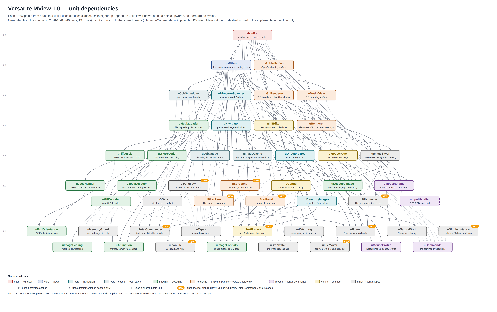
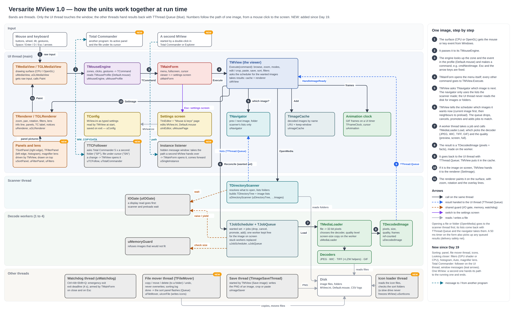

# How to read this

Every unit in `source\` starts with a header in the same layout:

| Section | What it says |
|---|---|
| **Purpose** | what the unit is for, in the program's terms |
| **Owns** | the objects, threads, timers and files it creates and frees |
| **Knows** | what it uses but does not own (handed in, global, callbacks) |
| **Responsibilities** | what it does |
| **Does NOT** | what it leaves to others, and to whom |
| **Threads** | which thread runs its code, and how shared data is protected |
| **Uses (MView units)** | generated from its `uses` clauses, plus the libraries |
| **Used by** | generated: which units use it |

Extra sections (Rules, Notes, Flow, Delivery safety net, ...) follow after these. The header is the
first thing to read before changing a unit; this document is the map that ties them together.

# Picture 1 — unit dependencies

{width=100%}

Arrows point from a unit to the units it uses. The layers (L0 at the bottom to L6 at the top) are the
dependency depth: a unit only uses units in lower layers, so there are **no cycles**. uMainForm is the
only unit that sees everything; the imaging units never see the window, and the utility units see
nothing of MView at all. Layers with many units are drawn as two staggered rows. Units marked NEW
came after Day 19: sorting (uSortPanel, uSortIcons, uSortFolders, uFileMover, uIconFile), looking
closer (uFilters, uFilterImage, uFilterPanel), Total Commander (uTCFollow, uTotalCommander) and the
single instance (uSingleInstance).

# Picture 2 — at run time

{width=100%}

The bands are threads. Only the UI thread touches the window and the renderers. The scanner thread,
the decode workers and the save thread never call into the UI; they hand their results back with
`TThread.Queue` (blue in the picture), and a 50 ms timer on the form picks up anything a lost wake-up
left in the queue (the delivery safety net in uMView). The I/O gate lets the image on screen read
the disk first; the memory guard refuses images that would not fit; the watchdog ends MView if a
shutdown hangs.

Since Day 19 (NEW in the picture): the sort and filter panels and the magnifier lens live on the UI
thread and are drawn by the renderers on top of the image; copies and moves run on the file mover
thread, icon files are read on a loader thread of their own; the Total Commander follower asks
Total Commander five times a second through window messages; a second MView hands its path to the
running one through a hidden message window and ends.

# The units in one line each

| Folder | Unit | Purpose | Runs on |
|---|---|---|---|
| main | uMainForm | The window: creates the viewer or the settings screen, the menu, fullscreen, cursor hiding; switches viewer ↔ settings (Esc). | UI |
| core | uMView | The viewer: carries out every command, browsing, modes, edit / crop / paste / save; asks for images and takes the results. | UI |
| core | uCommands | The command vocabulary (TCommand) that every input source produces. | any |
| core | uTypes | Small shared types and their MView.ini names. | any |
| core | uNavigator | Which folder and image are current; what next / previous mean. | UI |
| core | uDirectoryTree | The folders under the root as a tree, in visiting order. | scanner, then UI |
| core | uDirectoryImages | The image list of one folder, sorted. | scanner, then UI |
| core | uJobQueue | Decode jobs in a locked queue. | UI + workers |
| core | uJobScheduler | The decode worker threads; wanted set → jobs; results back to the UI. | UI + workers |
| core | uMediaView | The CPU drawing surface; passes input to its mouse engine. | UI |
| navigation | uDirectoryScanner | The scanner thread: resolves what to open, lists folders, builds the tree. | scanner |
| cache | uImageCache | Decoded images kept by name (LRU plus keep-window). | UI |
| imaging | uMediaLoader | File → pixels: picks the decoder and the quality level, makes the screen copy. | workers |
| imaging | uDecodedImage | A decoded image, read-only and reference-counted. | any |
| imaging | uJpegDecoder | Own JPEG decoder (fallback after WIC; cancellable). | workers |
| imaging | uJpegHeader | JPEG header and EXIF thumbnail without reading the whole file. | workers |
| imaging | uExifOrientation | The EXIF orientation value. | workers |
| imaging | uTiffQuick | Fast TIFF: only the needed rows of raw TIFFs, own parallel LZW. | workers (+ helpers) |
| imaging | uWicDecoder | Decoding through Windows WIC, in bands for huge PNG / TIFF / BMP. | workers |
| imaging | uGifDecoder | Own GIF decoder: first frame fast, all frames on demand. | workers |
| imaging | uAnimation | Animation frames, the frame cursor and the frame clock. | workers, then UI |
| imaging | uImageScaling | Fast box downscaling for screen copies. | workers |
| imaging | uImageFormats | The one list of image file extensions. | any |
| rendering | uRenderer | View state (fit, zoom, pan, rotation, overlays) and the CPU renderer. | UI |
| rendering | uGLRenderer | The GPU renderer: textures, tiles, mipmaps, overlay text. | UI |
| rendering | uGLMediaView | The OpenGL drawing surface. | UI |
| rendering | uSortPanel | The sort panel at the right edge: buttons, pin, flash, icon preview; drawn as one picture. | UI |
| rendering | uSortIcons | The slot icons: files read on a loader thread, pictures scaled on the UI thread. | UI + loader |
| rendering | uFilterPanel | The filter panel at the left edge: histogram, rows, Auto, Reset; drawn as one picture. | UI |
| mouse | uMouseEngine | Mouse and key input → commands, following the profile (zones, clicks, gestures). | UI |
| mouse | uMouseProfile | Default.mouse: zones, events, commands; read, check, save. | UI |
| mouse | uInputHandler | **Retired** (replaced by uMouseEngine + uMouseProfile); still compiled, used by nothing. | — |
| config | uConfig | MView.ini as typed settings. | UI |
| config | uSortFolders | The sort panel's folders (slots: folder, name, colour, icon) and recent folders, in MView.ini. | UI |
| config | uIniEditor | The settings screen: MView.ini in a text editor, with help per key. | UI |
| config | uMousePage | The "Mouse & keys" page, with "Try it here". | UI |
| utility | uIOGate | Display reads go first; the scanner and preloads wait. | workers, scanner |
| utility | uMemoryGuard | Refuses decodes that cannot fit in memory. | workers |
| utility | uWatchdog | Emergency exit hotkey and exit deadline, on its own thread. | watchdog |
| utility | uStopwatch | Millisecond clock and process age for the timing logs. | any |
| utility | uImageSaver | Saves an image as PNG on a background thread. | save thread |
| utility | uNaturalSort | File name ordering as in Explorer (numbers by value). | any |
| utility | uFileMover | Copy / move / delete (into a folder) / undo on a thread of its own; never overwrites; sorting.log. | mover thread |
| utility | uIconFile | .ico files: read the directory and pictures, write multi-size icons. | any |
| utility | uFilters | The display filters' maths: tone table, colour, Auto levels, names. | any |
| utility | uFilterImage | Filters, sharpening and turns applied to a bitmap; histograms. | UI |
| utility | uTCFollow | Follows Total Commander: asks for its folder and the file under its cursor. | UI |
| utility | uTotalCommander | Finds and starts Total Commander, side by side. | UI |
| utility | uSingleInstance | Only one MView: a second one hands its path over through a message window. | UI |

# Rules the structure follows

- **Input only makes commands.** The surfaces pass raw input to the mouse engine; the engine
  makes a TCommand; the form handles the menu and gives everything else to TMView.Execute.
- **The UI thread never reads the disk for images or folders.** The scanner lists folders, the
  workers read files; the UI thread only reads and writes MView.ini, Default.mouse and the CSV logs.
- **Threads never touch the UI.** Results come back with TThread.Queue, never Synchronize.
- **Decoding knows nothing about the window**, and rendering knows nothing about files.
- **Shared data is locked in exactly four places:** the job queue, the image cache, the directory
  scanner and the I/O gate — plus, since Day 21, the file mover's and the icon loader's own
  request queues.
- **Panels are pictures.** The sort and filter panels draw themselves into a bitmap; the renderers
  only put that bitmap on top (a texture on the GPU), so both renderers show them the same way.

# Housekeeping noticed while documenting (not changed)

- uInputHandler is retired but still in MView.lpr's uses and in the project, so it is compiled.
  It can be removed from both.
- Several settings in uConfig are never read from MView.ini and keep their built-in values
  (BackgroundColor, FitMode, Interpolation, UseMipMaps); TopMost, RememberZoom and RememberRotation
  are never set. To be decided when those features come up.
- MView.lpr's uses list does not name the newer units (uAnimation, uGifDecoder, uMouseEngine,
  uMouseProfile, uMousePage); they are compiled because other units use them. Harmless.

# What comes next

Release 1.0 freezes the viewer's feature set. The **microscopy edition** (measuring, calibration,
scale bar, instrument metadata, movies, image editing, Photoshop .8bf filters, Fiji through Fiji
itself) is a second program built from this same source tree: its own project file, its units in
`source\microscopy\`, on top of the units in these pictures. The core gets two hooks for it: a
metadata-reader layer and a measurement overlay in the renderers.
